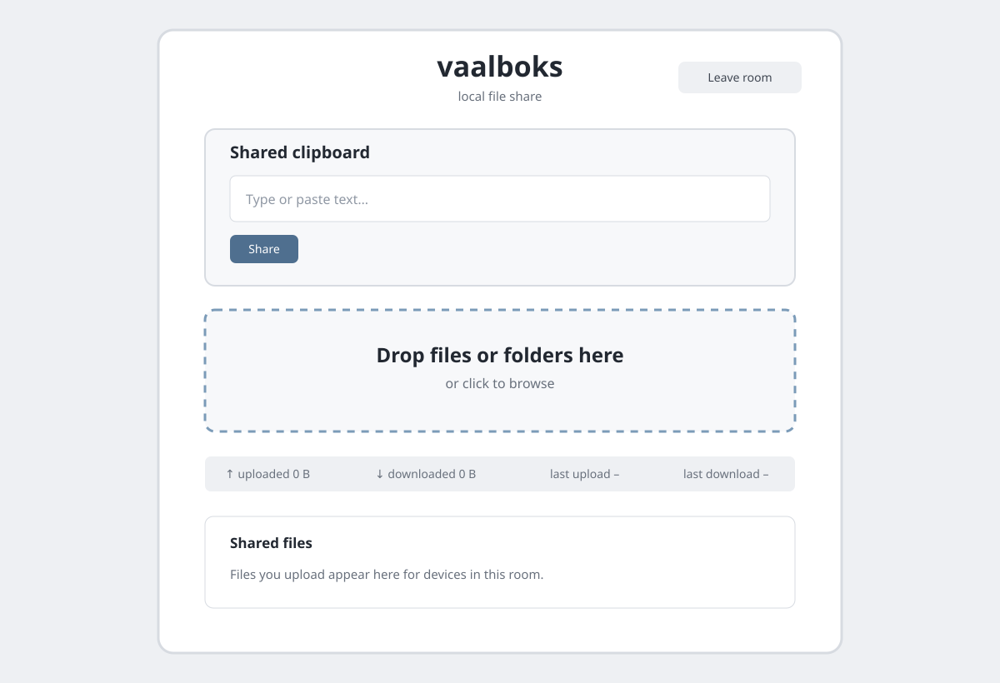

# vaalboks

<p align="center">
  
</p>

Vaalboks is a small file-sharing server for a local network. Drop files or
folders in the browser, then download them from another device on the same
network. It also supports sharing text snippets ("clipboard") between connected
devices.

The name is Afrikaans for a “dull box” — nothing fancy, just a basic tool for
moving files between devices without an external hosted service.

## Run

To use vaalboks, install `uv` and run:

```sh
uvx vaalboks
```

By default, vaalboks:

- Starts an HTTPS server on `0.0.0.0:8443` with two workers.
- Persists the SQLite database and shared files in `~/.vaalboks` (or
  `./vaalboks-data` when run from a checkout).
- Generates a local self-signed certificate on first launch.
- Prints the local-network URL and a QR code for that URL in the terminal.
- Uses a room phrase to isolate shared files between devices.
- Keeps room sessions valid for 12 hours.

Use `--http` only on a trusted network: room phrases, session cookies, uploads,
and downloads are then sent without transport encryption. Use `--no-persist`
for an ephemeral single-worker session; its database and shared files are lost
when the process exits.



For the easiest phone workflow, connect the phone and computer to the same
Wi-Fi, scan the startup QR code, and open the displayed URL. Choose a room
phrase when prompted, then use the same phrase on each device that should share
files. The phrase creates an isolated room, but a phrase alone is not
sufficient for public-internet exposure.

With the default HTTPS mode, accept the self-signed certificate warning on the
phone.

For advanced configuration, including running from a checkout, direct
Gunicorn deployment, and Django integration, see the
[documentation](docs/).

For the HTTP API and storage behavior, see the [API and storage
documentation](docs/API.md).

Example startup output:

```text
Vaalboks is ready. Open one of these URLs:
  https://<your-LAN-IP>:8443/

Scan this QR code on your phone:
  [QR code rendered here in the terminal]
```

## Built with

- Python 3.14 and Django 6.1
- Plain HTML, CSS, and JavaScript with HTMX
